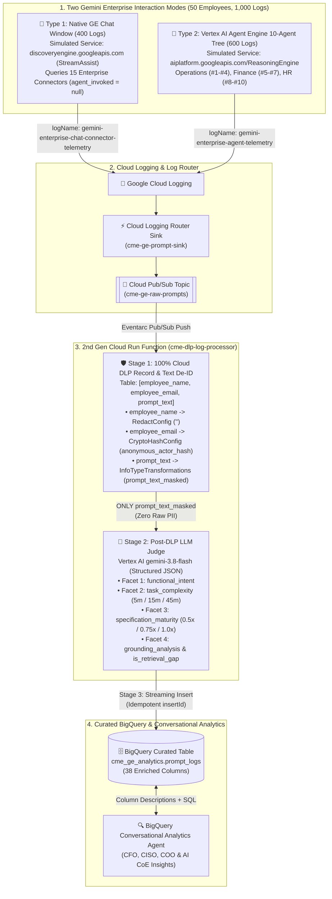

# Gemini Enterprise Prompt Analytics, 100% Cloud DLP & Post-DLP LLM Judge Demo

An end-to-end reference architecture and synthetic dataset demonstrating how enterprises can capture, de-identify, classify, and analyze **Gemini Enterprise (GE)** employee prompts across **Native Enterprise Connectors** and **Vertex AI Agent Engine Multi-Agent Trees** using **Google Cloud Sensitive Data Protection (Cloud DLP)**, **Vertex AI (`gemini-3.8-flash`)**, and **BigQuery**.

---

## 1. Overview & Business Scenario

**CME (Custom Manufacturing Enterprise)** operates four manufacturing facilities (*Detroit Stamping Plant*, *Toledo Assembly Plant*, *Houston Precision Machining*, and *Cleveland Foundry & Casting*) across three daily shifts (*Day*, *Swing*, and *Night*). CME has rolled out **Gemini Enterprise** to **50 employees** across **Operations (26)**, **Finance (12)**, and **HR (12)**.

As adoption scales, leadership must balance two critical requirements:
1. **CISO & Works Council Privacy Mandate (Zero Raw PII/PHI in BigQuery):** Employees frequently paste **Social Security Numbers (`SSNs`)**, **Bank Account & Routing Numbers**, **Dates of Birth (`DOBs`)**, **Employee Names & Emails**, and **Medical Injury PHI** into prompts. Neither the individuals mentioned in prompts nor the employees submitting prompts can be identifiable in the analytics warehouse.
2. **Executive ROI, Prompting Maturity & RAG Governance Mandate:** Leadership needs to measure **net productivity hours saved per Business Unit**, calculate a **Workforce Prompting Maturity Index (WMI)**, detect **RAG Retrieval Gaps** (hallucination risk where employees ask internal questions without triggering an Enterprise Connector), and correlate cross-pillar operational incidents (**"The Line 3 Hydraulic Press & Apex Steel Lot #402 Story"**).

---

## 2. End-to-End Solution Architecture



---

## 3. The Two Types of Gemini Enterprise Logs Included in `data/`

This repository includes **1,000 realistic synthetic log records** split across two distinct Gemini Enterprise interaction modes:

| Log Stream / Dataset | Volume | Cloud Logging `logName` | What It Captures |
| :--- | :--- | :--- | :--- |
| **Type 1: Native GE Chat + Enterprise Connectors**<br>([`data/raw_ge_chat_connector_logs/ge_chat_connector_logs_400.jsonl`](./data/raw_ge_chat_connector_logs/ge_chat_connector_logs_400.jsonl)) | **400 Logs** | `gemini-enterprise-chat-connector-telemetry` | Employees typing questions directly into the standard **Gemini Enterprise Chat Window** (`discoveryengine.googleapis.com` / `StreamAssist`) with `agent_invoked: null`. Searches **15 Enterprise Data Connectors** across **SharePoint**, **ServiceNow**, **SAP ERP**, **Workday**, **Google Drive**, **Jira**, and **Confluence**. |
| **Type 2: Vertex AI Agent Engine 10-Agent Tree**<br>([`data/raw_agent_tree_logs/agent_tree_logs_600.jsonl`](./data/raw_agent_tree_logs/agent_tree_logs_600.jsonl)) | **600 Logs** | `gemini-enterprise-agent-telemetry` | Employees invoking CME's **10 specialized ADK Agents** on **Vertex AI Agent Engine** (`aiplatform.googleapis.com/ReasoningEngine`), capturing `root_agent`, `leaf_agent`, and multi-agent delegation paths (`agent_tree_path`) across Operations (`#1–#4`), Finance (`#5–#7`), and HR (`#8–#10`). |

---

## 4. 100% Cloud DLP Anonymization & Post-DLP `gemini-3.8-flash` LLM Judge

### 4.1 Single-Call Cloud DLP Record & Prompt Transformation
Provisioned via [`scripts/setup_dlp_templates.py`](./scripts/setup_dlp_templates.py), the saved Cloud DLP templates (`cme-ge-prompt-inspect-template` and `cme-ge-prompt-deidentify-template`) process each log entry as a 3-column Cloud DLP `Table` (`employee_name`, `employee_email`, `prompt_text`):
* **`employee_name` (`RedactConfig`):** Completely removed by Cloud DLP.
* **`employee_email` (`CryptoHashConfig`):** Deterministically hashed inside Cloud DLP into `anonymous_actor_hash` (`usr_<8hex>`), mapping the 50 employees 1-to-1 to 50 unique anonymous IDs across all 1,000 logs.
* **`prompt_text` (`InfoTypeTransformations`):**
  * Partially masks `US_SOCIAL_SECURITY_NUMBER` and `CME_SYNTHETIC_US_SSN` (`***-**-7742`) and `FINANCIAL_ACCOUNT_NUMBER` (`******8812`).
  * Replaces `PERSON_NAME`, `EMAIL_ADDRESS`, `DATE_OF_BIRTH`, and `US_BANK_ROUTING_MICR` with `[INFO_TYPE]` tags.
  * Flags `MEDICAL_TERM` in DLP metadata (`contains_medical_phi = TRUE`, triggering `CRITICAL` `is_toxic_combination` alerts when paired with an SSN) while keeping the clinical injury term readable in text so safety analysts can correlate injuries with equipment faults without knowing *who* was injured.

### 4.2 Post-DLP LLM Judge & Prompt Coach (`gemini-3.8-flash` on Vertex AI)
Strictly **after** Cloud DLP de-identifies the record, [`cloud_function/main.py`](./cloud_function/main.py) calls **`gemini-3.8-flash`** (`temperature=0.0`, Structured Outputs via Pydantic `LLMJudgeClassification`) on `prompt_text_masked` to populate **5 Facets**:
1. **Facet 1 — `functional_intent`:** `'generation_drafting'`, `'transformation_summary'`, `'code_scripting'`, `'info_seeking_qa'`, `'data_extraction'`, or `'analytical_reasoning'`.
2. **Facet 2 — `task_complexity`:** `'low'` (`5 min` baseline), `'medium'` (`15 min` baseline), or `'high'` (`45 min` baseline).
3. **Facet 3 — `specification_maturity` (`STRUCT`):** `level_1_underspecified` (`0.5x`), `level_2_basic_directive` (`0.75x`), or `level_3_well_engineered` (`1.0x`), plus `has_persona`, `has_explicit_format`, `has_constraints`, and `is_search_query_style`.
4. **Facet 4 — `grounding_analysis` (`STRUCT`) & `is_retrieval_gap` (`BOOL`):** Identifies `enterprise_rag` vs. `in_context_attachment` vs. `parametric_general`, `requires_enterprise_knowledge`, `target_corpus`, and flags `is_retrieval_gap = TRUE` whenever an employee asks a CME-specific question without RAG grounding.
5. **Facet 5 — `prompt_coaching` (`STRUCT`) & `potential_extra_minutes_unlocked` (`FLOAT64`):** Identifies `missing_elements`, writes a 1–2 sentence `improvement_recommendation`, generates a ready-to-use `rewritten_level_3_prompt`, recommends the best CME agent or connector (`recommended_target_agent_or_connector`), and calculates `potential_extra_minutes_unlocked = estimated_manual_minutes * (1.0 - maturity_multiplier)`.

---

## 5. Repository Structure

```text
ge-prompt-analytics/
├── README.md                                                   # Project overview, architecture & quickstart
├── Solution_Description.md                                     # Comprehensive technical & semantic reference guide
├── implementation.md                                           # Step-by-step GCP deployment & demo runbook
├── data/
│   ├── employees/
│   │   └── cme_employees_50.json                               # 50 synthetic CME employees across Operations, Finance, and HR
│   ├── raw_ge_chat_connector_logs/
│   │   └── ge_chat_connector_logs_400.jsonl                    # 400 raw logs: Native GE Chat Window + Enterprise Connectors
│   ├── raw_agent_tree_logs/
│   │   └── agent_tree_logs_600.jsonl                           # 600 raw logs: Vertex AI Agent Engine 10-Agent Tree
│   └── curated_bigquery_post_dlp/
│       └── cme_bigquery_masked_1000.jsonl                      # 1,000 post-DLP preview records
├── scripts/
│   ├── generate_synthetic_logs.py                              # Generates the 50-employee roster and 400 + 600 log files
│   ├── setup_dlp_templates.py                                  # Provisions & tests the 2 saved Cloud DLP Templates in GCP
│   └── ingest_to_cloud_logging.py                              # Batch-ingests the 400 + 600 JSONL logs into Cloud Logging API
├── cloud_function/
│   ├── main.py                                                 # 2nd Gen Cloud Run Function (Cloud DLP Table + Gemini 3.8 Flash Judge + BQ)
│   └── requirements.txt                                        # Python dependencies for the Cloud Run Function
└── bigquery/
    └── schema_and_queries.sql                                  # BigQuery 38-column DDL + 5 Executive, ROI, RAG & CISO SQL queries
```

---

## 6. Quickstart Deployment

```bash
export PROJECT_ID="your-gcp-project-id"
export REGION="us-central1"

# 1. Enable required Google Cloud APIs
gcloud services enable \
  logging.googleapis.com pubsub.googleapis.com dlp.googleapis.com \
  aiplatform.googleapis.com cloudfunctions.googleapis.com run.googleapis.com \
  eventarc.googleapis.com cloudbuild.googleapis.com artifactregistry.googleapis.com \
  bigquery.googleapis.com --project="$PROJECT_ID"

# 2. Set up local Python virtual environment
python3 -m venv .venv
.venv/bin/pip install google-cloud-dlp google-cloud-logging google-cloud-bigquery google-genai pydantic

# 3. Create & test the saved Cloud DLP Templates (Inspect + 3-Column Record De-identify)
.venv/bin/python scripts/setup_dlp_templates.py --project "$PROJECT_ID" --test

# 4. Create the BigQuery Dataset & 38-Column Table (cme_ge_analytics.prompt_logs)
bq --project_id="$PROJECT_ID" query --use_legacy_sql=false < bigquery/schema_and_queries.sql

# 5. Create Pub/Sub Topic, Deploy 2nd Gen Cloud Run Function, and Configure Log Router Sink
gcloud pubsub topics create cme-ge-raw-prompts --project="$PROJECT_ID"

gcloud functions deploy cme-dlp-log-processor \
  --gen2 \
  --runtime=python311 \
  --region="$REGION" \
  --source=./cloud_function \
  --entry-point=process_prompt_log \
  --trigger-topic=cme-ge-raw-prompts \
  --timeout=120s \
  --memory=1Gi \
  --set-env-vars="GOOGLE_CLOUD_PROJECT=${PROJECT_ID},DLP_LOCATION=global,VERTEX_LOCATION=global,LLM_JUDGE_MODEL=gemini-3.8-flash,BQ_DATASET=cme_ge_analytics,BQ_TABLE=prompt_logs" \
  --project="$PROJECT_ID"

gcloud logging sinks create cme-ge-prompt-sink \
  "pubsub.googleapis.com/projects/${PROJECT_ID}/topics/cme-ge-raw-prompts" \
  --log-filter='logName="projects/'"${PROJECT_ID}"'/logs/gemini-enterprise-chat-connector-telemetry" OR logName="projects/'"${PROJECT_ID}"'/logs/gemini-enterprise-agent-telemetry"' \
  --project="$PROJECT_ID"

SINK_WRITER=$(gcloud logging sinks describe cme-ge-prompt-sink --project="$PROJECT_ID" --format='value(writerIdentity)')
gcloud pubsub topics add-iam-policy-binding cme-ge-raw-prompts \
  --member="$SINK_WRITER" --role="roles/pubsub.publisher" --project="$PROJECT_ID"

# 6. Ingest the 400 Native GE Chat logs + 600 Agent Tree logs into Cloud Logging
.venv/bin/python scripts/ingest_to_cloud_logging.py --project "$PROJECT_ID" --source all
```

---

## 7. Documentation & Deep-Dive References

* **[`Solution_Description.md`](./Solution_Description.md):** Full technical reference covering the two Gemini Enterprise log types, the 10-Agent Tree topology, the 3-column Cloud DLP Record Transformation rules, the 4-Facet `gemini-3.8-flash` LLM Judge taxonomy, the 38-column BigQuery semantic dictionary, and **"The Line 3 Hydraulic Press Story"**.
* **[`implementation.md`](./implementation.md):** Detailed step-by-step GCP implementation guide and customer "Show & Tell" demo flow.
* **[`bigquery/schema_and_queries.sql`](./bigquery/schema_and_queries.sql):** BigQuery table DDL and 5 ready-to-run analytical SQL queries for Workforce Maturity, Retrieval Gaps, Business Unit ROI, CISO DLP Governance, and Cross-Pillar Root-Cause Correlation.

---

## 8. Disclaimers
This is not an officially supported Google product. This software is provided "as is", without warranty of any kind, expressed or implied, including but not limited to, the warranties of merchantability, fitness for a particular purpose, and/or infringement.
