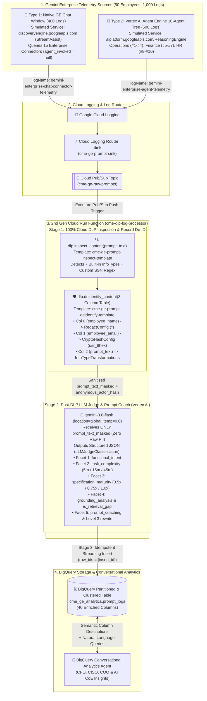
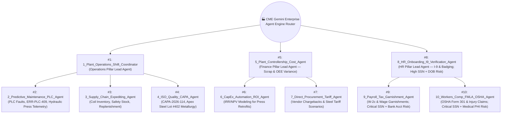
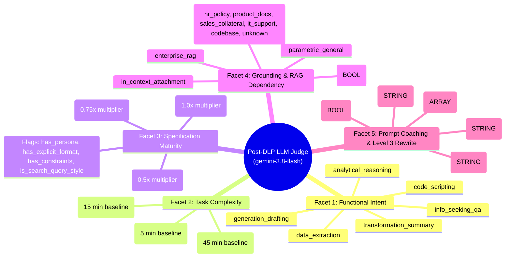

# CME Manufacturing — Gemini Enterprise Prompt Analytics, 100% Cloud DLP & Post-DLP LLM Judge Solution
## Comprehensive Solution Description & Technical Reference (`Solution_Description.md`)

---

## Table of Contents
1. [Executive Summary & Business Scenario](#1-executive-summary--business-scenario)
2. [End-to-End Solution Architecture](#2-end-to-end-solution-architecture)
3. [Deep Dive: The Two Types of Gemini Enterprise Logs](#3-deep-dive-the-two-types-of-gemini-enterprise-logs)
4. [Step-by-Step Pipeline Components & Mechanics](#4-step-by-step-pipeline-components--mechanics)
5. [100% Cloud DLP Record & Prompt De-identification Architecture](#5-100-cloud-dlp-record--prompt-de-identification-architecture)
6. [Post-DLP LLM Judge & Prompt Coach (`gemini-3.8-flash`) & 5-Facet ROI Framework](#6-post-dlp-llm-judge--prompt-coach-gemini-38-flash--5-facet-roi-framework)
7. [BigQuery Curated Data Model & Semantic Column Reference (`40 Columns`)](#7-bigquery-curated-data-model--semantic-column-reference-40-columns)
8. [Cross-Pillar Executive Storytelling: "The Line 3 Hydraulic Press Story"](#8-cross-pillar-executive-storytelling-the-line-3-hydraulic-press-story)
9. [Deployed GCP Resources & Demo Walkthrough Guide](#9-deployed-gcp-resources--demo-walkthrough-guide)

---

## 1. Executive Summary & Business Scenario

### 1.1 Customer Profile: CME (Custom Manufacturing Enterprise)
**CME (Custom Manufacturing Enterprise)** is an industrial manufacturer operating four production facilities across three daily shifts:
* **Plants:** *Detroit Stamping Plant*, *Toledo Assembly Plant*, *Houston Precision Machining*, and *Cleveland Foundry & Casting*.
* **Shifts:** *Shift 1 (Day)*, *Shift 2 (Swing)*, and *Shift 3 (Night)*.
* **Workforce Cohort:** **50 employees** across three core business units (**Operations: 26 employees**, **Finance: 12 employees**, and **HR: 12 employees**) who actively use **Gemini Enterprise (GE)** in their daily workflows.

### 1.2 The Core Enterprise Challenge
As CME scales Gemini Enterprise across its plants and corporate offices, leadership faces two competing mandates:

1. **The CISO & Works Council Privacy Mandate (Zero Raw PII/PHI in Analytics):**
   * HR specialists, payroll analysts, and shop-floor supervisors routinely paste highly sensitive data directly into prompts — including **Social Security Numbers (`SSNs`)**, **Bank Account & Routing Numbers**, **Dates of Birth (`DOBs`)**, **Employee Names & Emails**, and **Clinical Medical Injury Descriptions (`PHI`)** from OSHA/Workers' Comp claims.
   * Furthermore, Works Council and employee privacy policies prohibit storing the **submitting employee's name or email** in an analytics warehouse where managers could monitor individual workers by name.
2. **The CFO, COO & AI Center of Excellence Mandate (Adoption, Maturity, RAG Health, Prompt Coaching & ROI):**
   * Leadership needs to quantify **net productivity hours saved per Business Unit**, measure **Workforce Prompting Maturity** (identifying who is using Gemini like a 3-word Google search engine vs. writing well-engineered prompts), provide **automated Gold-Standard Level 3 Prompt Coaching rewrites**, pinpoint **RAG Retrieval Gaps** (where employees ask internal CME questions without triggering an Enterprise Connector), and uncover **cross-pillar operational root causes** across Operations, Finance, and HR.

### 1.3 How This Solution Solves Both Mandates
This solution implements a serverless, event-driven telemetry pipeline on Google Cloud (`Cloud Logging -> Log Router Sink -> Pub/Sub -> 2nd Gen Cloud Run Function -> Cloud DLP + Vertex AI Gemini 3.8 Flash Judge -> BigQuery`):
* **100% of Identity & Text Anonymization is Performed by Google Cloud DLP:** A single saved Cloud DLP De-identification Template (`cme-ge-prompt-deidentify-template`) transforms a structured 3-column `Table` (`employee_name`, `employee_email`, `prompt_text`) in-flight:
  * `employee_name` is completely removed via **`RedactConfig`**.
  * `employee_email` is deterministically hashed via **`CryptoHashConfig`** into `anonymous_actor_hash` (`usr_<8hex>`), preserving 1-to-1 longitudinal user analytics (`50 employees -> 50 unique IDs`) without ever exposing who the employee is.
  * `prompt_text` is sanitized via **`InfoTypeTransformations`**, masking SSNs (`***-**-7742`) and bank accounts (`******8812`) and replacing direct identifiers with `[PERSON_NAME]`, `[EMAIL_ADDRESS]`, `[DATE_OF_BIRTH]`, and `[US_BANK_ROUTING_MICR]`, while intentionally preserving `MEDICAL_TERM` text so safety incidents can be correlated with machine faults.
* **Post-DLP Evaluation & Coaching via Vertex AI `gemini-3.8-flash` LLM Judge:** Strictly **after** Cloud DLP strips PII, the Cloud Run Function invokes **`gemini-3.8-flash`** using Structured Outputs to classify `prompt_text_masked` and generate Level 3 prompt rewrites across a **5-Facet Prompt Classification, ROI & Coaching Framework** before streaming the enriched row to BigQuery (`cme_ge_analytics.prompt_logs`).

---

## 2. End-to-End Solution Architecture



---

## 3. Deep Dive: The Two Types of Gemini Enterprise Logs

A foundational design element of this demo is that enterprise employees do **not** interact with Gemini Enterprise in only one way. In a real production deployment, telemetry originates from **two distinct interaction modes**. Both are represented in separate raw JSONL files in [`data/`](file:///Users/wanderas/Documents/gcp/NewProjects/cme-ge-prompt-analytics-demo/data) and ingested into separate Cloud Logging streams so they can be inspected side by side or analyzed together in BigQuery.

---

### 3.1 Log Type 1: Native Gemini Enterprise Chat + Enterprise Connectors (`GE_CHAT_CONNECTOR_SEARCH`)

* **Dataset File:** [`data/raw_ge_chat_connector_logs/ge_chat_connector_logs_400.jsonl`](file:///Users/wanderas/Documents/gcp/NewProjects/cme-ge-prompt-analytics-demo/data/raw_ge_chat_connector_logs/ge_chat_connector_logs_400.jsonl) (**400 Logs**)
* **Cloud Logging Stream (`logName`):** `projects/<PROJECT_ID>/logs/gemini-enterprise-chat-connector-telemetry`
* **Simulated GCP Service & Method:** `discoveryengine.googleapis.com` / `google.cloud.discoveryengine.v1.AssistService.StreamAssist`
* **What It Represents:**
  Employees open the out-of-the-box **Gemini Enterprise Web Chat Window** and type a question or instruction directly. **No custom ADK agent is invoked** (`agent_invoked: null`, `root_agent: "NONE (Native GE Chat)"`, `leaf_agent: "NONE (Native GE Chat)"`). Instead, Gemini Enterprise uses **Enterprise Data Connectors** (`connectors_queried`) to ground its response against CME's internal SaaS and ERP repositories (or answers from general model weights if no connector is triggered).

#### Enterprise Connectors Queried Across the 400 Native Chat Logs
| Business Pillar | Enterprise Connectors Queried (`connectors_queried`) | Typical Employee Prompts in Native GE Chat |
| :--- | :--- | :--- |
| **Operations** | • `SharePoint_Manufacturing_SOPs`<br>• `ServiceNow_Plant_Tickets`<br>• `Jira_Quality_CAPA`<br>• `SAP_ERP_Materials`<br>• `Google_Drive_Shift_Logs` | • Searching lockout/tagout (LOTO) SOPs for the **Line 3 Schuler 800T Hydraulic Press** (`ERR-PLC-409`).<br>• Looking up **CAPA-2026-114** and **Apex Steel Lot #402** tensile/thickness test failures.<br>• *Shadow AI Risk:* Shop-floor supervisors searching or pasting shift logs containing temporary workers' SSNs into `Google_Drive_Shift_Logs`. |
| **Finance** | • `SAP_ERP_Financials`<br>• `Google_Drive_Finance_Q3`<br>• `SAP_ERP_Procurement`<br>• `SharePoint_Vendor_Contracts` | • Querying Q3 MTD scrap variance (`$142.4K` unfavorable variance on Line 3).<br>• Checking supplier chargeback clauses in `SharePoint_Vendor_Contracts` for **Apex Steel Lot #402**.<br>• Modeling Section 301 tariff impacts on imported cold-rolled steel coils. |
| **HR** | • `Workday_HR_Records`<br>• `SharePoint_Union_Contracts`<br>• `Workday_Payroll_Docs`<br>• `Google_Drive_Garnishment_Orders`<br>• `ServiceNow_HR_Case_Mgmt`<br>• `Confluence_Safety_OSHA_Policies` | • Searching `Workday_HR_Records` for temp-to-perm I-9 verification packets (often pasting raw **SSNs + DOBs + Emails**).<br>• Searching `Workday_Payroll_Docs` and `Google_Drive_Garnishment_Orders` for wage garnishments (pasting **SSNs + Bank Account & Routing Numbers**).<br>• Searching `Confluence_Safety_OSHA_Policies` for Line 3 press-jam injury reporting rules (**SSNs + Medical Injury PHI**). |

#### Raw JSONL Structure of a Type 1 Log (`GE_CHAT_CONNECTOR_SEARCH`)
```json
{
  "insertId": "cme-chat-0001-9f82a1b4c3",
  "timestamp": "2026-09-17T18:15:35.434Z",
  "severity": "INFO",
  "logName": "projects/cme-manufacturing-prod/logs/gemini-enterprise-chat-connector-telemetry",
  "resource": {
    "type": "discoveryengine.googleapis.com/AssistEngine",
    "labels": {
      "project_id": "cme-manufacturing-prod",
      "location": "global",
      "engine_id": "cme-gemini-enterprise-portal"
    }
  },
  "trace": "projects/cme-manufacturing-prod/traces/4a81b902f3c1e78459012a3b4c5d6e7f",
  "spanId": "a1b2c3d4e5f60718",
  "jsonPayload": {
    "event_type": "GEMINI_ENTERPRISE_CHAT_QUERY",
    "interaction_type": "GE_CHAT_CONNECTOR_SEARCH",
    "service_name": "discoveryengine.googleapis.com",
    "method_name": "google.cloud.discoveryengine.v1.AssistService.StreamAssist",
    "agent_invoked": null,
    "connectors_queried": [
      "Workday_HR_Records",
      "SharePoint_Union_Contracts"
    ],
    "employee_id": "EMP-041",
    "employee_name": "Scott Adams",
    "employee_email": "s.adams@cme-mfg.com",
    "department": "HR",
    "employee_role": "HR Onboarding Coordinator",
    "plant_location": "Detroit Stamping Plant",
    "shift": "Shift 1 (Day)",
    "pillar": "HR",
    "operational_entity": "Temp-to-Perm Cohort Q3",
    "topic_cluster": "Temp-to-Perm Onboarding CSV Paste (SSN + DOB)",
    "prompt_text": "Search Workday and SharePoint for the temporary-to-permanent I-9 onboarding packet for Carlos Rivera (Email: c.rivera.temp@staffing-partner.org, SSN: 000-45-8921, DOB: 04/12/1988) and verify UAW Local 142 seniority bridging eligibility.",
    "latency_ms": 1240,
    "prompt_tokens": 58,
    "response_tokens": 310
  }
}
```

---

### 3.2 Log Type 2: Vertex AI Agent Engine 10-Agent Tree (`AGENT_TREE_EXECUTION`)

* **Dataset File:** [`data/raw_agent_tree_logs/agent_tree_logs_600.jsonl`](file:///Users/wanderas/Documents/gcp/NewProjects/cme-ge-prompt-analytics-demo/data/raw_agent_tree_logs/agent_tree_logs_600.jsonl) (**600 Logs**)
* **Cloud Logging Stream (`logName`):** `projects/<PROJECT_ID>/logs/gemini-enterprise-agent-telemetry`
* **Simulated GCP Service & Method:** `aiplatform.googleapis.com/ReasoningEngine` / `google.cloud.aiplatform.v1.ReasoningEngineExecutionService.QueryReasoningEngine`
* **What It Represents:**
  Employees invoke CME's **10 specialized ADK Agents** hosted on **Vertex AI Agent Engine**. These agents are organized into a 3-Pillar hierarchical tree where a **Pillar Lead Agent (`root_agent`)** either handles the request directly or delegates to a specialized **Sub-Agent (`leaf_agent`)**, recording the full hop sequence in `agent_tree_path`.

#### Topology of the CME 10-Agent Tree


#### Raw JSONL Structure of a Type 2 Log (`AGENT_TREE_EXECUTION`)
```json
{
  "insertId": "cme-agent-0001-7c31d8e2a5",
  "timestamp": "2026-09-18T14:22:11.802Z",
  "severity": "INFO",
  "logName": "projects/cme-manufacturing-prod/logs/gemini-enterprise-agent-telemetry",
  "resource": {
    "type": "aiplatform.googleapis.com/ReasoningEngine",
    "labels": {
      "project_id": "cme-manufacturing-prod",
      "location": "us-central1",
      "reasoning_engine_id": "10_Workers_Comp_FMLA_OSHA_Agent"
    }
  },
  "trace": "projects/cme-manufacturing-prod/traces/9e81c742a104b5632189f0e1d2c3b4a5",
  "spanId": "f1e2d3c4b5a69788",
  "jsonPayload": {
    "event_type": "AGENT_ENGINE_EXECUTION",
    "interaction_type": "AGENT_TREE_EXECUTION",
    "service_name": "aiplatform.googleapis.com/ReasoningEngine",
    "method_name": "google.cloud.aiplatform.v1.ReasoningEngineExecutionService.QueryReasoningEngine",
    "root_agent": "8_HR_Onboarding_I9_Verification_Agent",
    "leaf_agent": "10_Workers_Comp_FMLA_OSHA_Agent",
    "agent_tree_path": [
      "8_HR_Onboarding_I9_Verification_Agent",
      "10_Workers_Comp_FMLA_OSHA_Agent"
    ],
    "connectors_queried": [],
    "employee_id": "EMP-047",
    "employee_name": "Allison Mitchell",
    "employee_email": "a.mitchell@cme-mfg.com",
    "department": "HR",
    "employee_role": "Workers' Comp & Leave Specialist",
    "plant_location": "Detroit Stamping Plant",
    "shift": "Shift 1 (Day)",
    "pillar": "HR",
    "operational_entity": "Line 3 (ERR-PLC-409)",
    "topic_cluster": "Line 3 Press Jam Injury: Workers' Comp & OSHA (SSN + Medical PHI)",
    "prompt_text": "Draft the state Workers' Comp claim narrative and OSHA Form 301 incident entry for Sarah Jenkins (Email: s.jenkins@cme-mfg.com, SSN: 000-31-7742, DOB: 08/19/1984) who suffered an L4-L5 lumbar disc herniation clearing a jammed stamping die on Line 3 (fault ERR-PLC-409).",
    "latency_ms": 2890,
    "prompt_tokens": 74,
    "response_tokens": 485
  }
}
```

---

### 3.3 Side-by-Side Comparison of the Two Log Types

| Dimension | Type 1: `GE_CHAT_CONNECTOR_SEARCH` (400 Logs) | Type 2: `AGENT_TREE_EXECUTION` (600 Logs) |
| :--- | :--- | :--- |
| **User Experience** | Standard Gemini Enterprise Chat Window (`StreamAssist`) | Invoking specialized ADK Agents on Vertex AI Agent Engine |
| **Cloud Logging `logName`** | `projects/<PROJECT_ID>/logs/gemini-enterprise-chat-connector-telemetry` | `projects/<PROJECT_ID>/logs/gemini-enterprise-agent-telemetry` |
| **Top-Level Cloud Logging Labels** | `interaction_type="GE_CHAT_CONNECTOR_SEARCH"`, `simulated_service="discoveryengine.googleapis.com"` | `interaction_type="AGENT_TREE_EXECUTION"`, `simulated_service="aiplatform.googleapis.com/ReasoningEngine"` |
| **Agent Fields in BigQuery** | `root_agent = "NONE (Native GE Chat)"`<br>`leaf_agent = "NONE (Native GE Chat)"` | `root_agent = "<Pillar_Lead_Agent>"`<br>`leaf_agent = "<Specialist_Sub_Agent>"` |
| **`agent_tree_path` Format** | `"GE_Chat_Window -> SharePoint_Manufacturing_SOPs + ServiceNow_Plant_Tickets"` | `"1_Plant_Operations_Shift_Coordinator -> 2_Predictive_Maintenance_PLC_Agent"` |
| **`connectors_queried` Array** | Populated with 1–3 Enterprise Connectors (or empty if ungrounded) | Empty array `[]` (grounding handled via internal ADK agent tools) |
| **Dominant LLM Judge Intent** | `info_seeking_qa`, `transformation_summary` | `analytical_reasoning`, `generation_drafting`, `data_extraction`, `code_scripting` |

---

## 4. Step-by-Step Pipeline Components & Mechanics

### Step 1: Log Ingestion via Cloud Logging API ([`scripts/ingest_to_cloud_logging.py`](file:///Users/wanderas/Documents/gcp/NewProjects/cme-ge-prompt-analytics-demo/scripts/ingest_to_cloud_logging.py))
* **Component:** Python ingestion script using `google-cloud-logging` (`client.logger(log_name).batch()`).
* **How Logs Are Identified When Ingested via the API:**
  Because the logs are written via the Cloud Logging API (`entries.write`) rather than emitted by a managed GCP control plane, Cloud Logging requires a valid custom monitored resource (`resource.type = "global"`) and identifies the two streams via **three mechanisms**:
  1. **Distinct `logName` Streams:**
     * `projects/<PROJECT_ID>/logs/gemini-enterprise-chat-connector-telemetry` (400 logs)
     * `projects/<PROJECT_ID>/logs/gemini-enterprise-agent-telemetry` (600 logs)
  2. **Top-Level `LogEntry.labels`:** Indexed key-value labels attached to the outer Cloud Logging envelope (`cme_demo="gemini-enterprise-prompt-analytics"`, `interaction_type`, `simulated_service`, `pillar`, `plant_location`).
  3. **Structured `jsonPayload` Fields:** Preserves `interaction_type`, `service_name`, `method_name`, `connectors_queried`, `root_agent`, `leaf_agent`, `employee_name`, `employee_email`, and `prompt_text`.
* **Batching:** Commits entries in batches of **250 records** per API call while preserving original `insertId`, `trace`, and `spanId` metadata.

---

### Step 2: Cloud Logging Router Sink (`cme-ge-prompt-sink`) & Cloud Pub/Sub (`cme-ge-raw-prompts`)
* **Component:** Cloud Logging Log Router Sink (`cme-ge-prompt-sink`) publishing to Cloud Pub/Sub topic `projects/<PROJECT_ID>/topics/cme-ge-raw-prompts`.
* **Inclusion Filter:**
  ```text
  logName="projects/genai-demos-391416/logs/gemini-enterprise-chat-connector-telemetry" OR
  logName="projects/genai-demos-391416/logs/gemini-enterprise-agent-telemetry"
  ```
* **Security & IAM:** The sink's dedicated Google-managed writer identity (`service-<PROJECT_NUMBER>@gcp-sa-logging.iam.gserviceaccount.com`) is granted `roles/pubsub.publisher` on `cme-ge-raw-prompts`.
* **Why Pub/Sub sits between Cloud Logging and Cloud Run:** Decouples log ingestion spikes from downstream Cloud DLP and Vertex AI LLM Judge API latency, providing automatic buffering and backpressure management.

---

### Step 3: Eventarc Trigger & 2nd Gen Cloud Run Function (`cme-dlp-log-processor`)
* **Component:** [`cloud_function/main.py`](file:///Users/wanderas/Documents/gcp/NewProjects/cme-ge-prompt-analytics-demo/cloud_function/main.py) deployed as a 2nd Gen Cloud Run Function (`python311`, `1 vCPU`, `1 GiB RAM`, `--concurrency=20`, `--max-instances=50`).
* **Entry Point:** `@functions_framework.cloud_event def process_prompt_log(cloud_event: CloudEvent)`
* **Execution Sequence per Log Event:**
  1. Decodes the Base64-encoded Cloud Logging `LogEntry` JSON from the Pub/Sub push payload.
  2. Executes **Stage 1 (100% Cloud DLP Inspection & Record De-identification)**.
  3. Executes **Stage 2 (Post-DLP Vertex AI `gemini-3.8-flash` LLM Judge Classification)**.
  4. Executes **Stage 3 (BigQuery Streaming Insert with Idempotent `insert_id`)**.

---

## 5. 100% Cloud DLP Record & Prompt De-identification Architecture

All PII/PHI detection, redaction, cryptographic hashing, and masking are performed inside **Google Cloud Sensitive Data Protection (Cloud DLP)** using two saved templates provisioned by [`scripts/setup_dlp_templates.py`](file:///Users/wanderas/Documents/gcp/NewProjects/cme-ge-prompt-analytics-demo/scripts/setup_dlp_templates.py). **Zero custom hashing or regex masking happens in Python.**

### 5.1 Saved Template 1: `cme-ge-prompt-inspect-template`
Inspects `prompt_text` for **7 built-in InfoTypes** plus **1 Custom InfoType Detector**:
* **Built-in InfoTypes:**
  * `US_SOCIAL_SECURITY_NUMBER`
  * `PERSON_NAME`
  * `EMAIL_ADDRESS`
  * `DATE_OF_BIRTH`
  * `FINANCIAL_ACCOUNT_NUMBER`
  * `US_BANK_ROUTING_MICR`
  * `MEDICAL_TERM`
* **Why the Custom InfoType (`CME_SYNTHETIC_US_SSN`) Is Included:**
  * For safety, all synthetic SSNs in the demo dataset use the non-issuable `000-XX-XXXX` range (e.g., `000-31-7742`).
  * Google Cloud DLP's built-in `US_SOCIAL_SECURITY_NUMBER` detector validates IRS/SSA area numbers and intentionally ignores `000` area numbers because they are impossible in real life.
  * By adding the custom regex detector `CME_SYNTHETIC_US_SSN` (`\b000-\d{2}-\d{4}\b`, likelihood `VERY_LIKELY`) inside `cme-ge-prompt-inspect-template`, Cloud DLP detects both real SSNs and synthetic `000-XX-XXXX` demo SSNs with 100% accuracy.

---

### 5.2 Saved Template 2: `cme-ge-prompt-deidentify-template` (3-Column `Table` Record Transformation)
Instead of sending only a plain string to Cloud DLP, [`cloud_function/main.py`](file:///Users/wanderas/Documents/gcp/NewProjects/cme-ge-prompt-analytics-demo/cloud_function/main.py#L228-L260) constructs a 3-column Cloud DLP `Table` item for every log entry:

| Column Index | Field Name (`FieldId`) | Cloud DLP Transformation Rule (`field_transformations`) | Input Example | Cloud DLP Output |
| :--- | :--- | :--- | :--- | :--- |
| **Col 0** | `employee_name` | **`RedactConfig`** (`primitive_transformation.redact_config`) | `"Allison Mitchell"` | `""` *(Completely removed by Cloud DLP)* |
| **Col 1** | `employee_email` | **`CryptoHashConfig`** (`primitive_transformation.crypto_hash_config` using a 256-bit key stored inside the template) | `"a.mitchell@cme-mfg.com"` | `"SQ8tf6T2KLX1Z0cLlmXdASABmTnPoQvbBi48X5qJ/sU="` $\rightarrow$ formatted as `usr_490f2d7f` (`anonymous_actor_hash`) |
| **Col 2** | `prompt_text` | **`InfoTypeTransformations`** (`info_type_transformations` guided by `cme-ge-prompt-inspect-template`):<br>• **Rule 3a (SSNs):** `CharacterMaskConfig` masks first 5 digits with `*` (skipping `-`), leaving last 4 digits.<br>• **Rule 3b (Bank Accounts):** `CharacterMaskConfig` masks first 6 digits with `*`.<br>• **Rule 3c (Direct Identifiers):** `ReplaceWithInfoTypeConfig` replaces `PERSON_NAME`, `EMAIL_ADDRESS`, `DATE_OF_BIRTH`, and `US_BANK_ROUTING_MICR` with `[INFO_TYPE]` tags.<br>• **Rule 3d (`MEDICAL_TERM`):** Flagged in `inspect_content` findings, but **not redacted** in `prompt_text` so safety analysts can see injury types (*L4-L5 lumbar disc herniation*) without knowing *who* was injured. | `"Draft the state Workers' Comp claim narrative for Sarah Jenkins (Email: s.jenkins@cme-mfg.com, SSN: 000-31-7742, DOB: 08/19/1984) who suffered an L4-L5 lumbar disc herniation..."` | `"Draft the state Workers' Comp claim narrative for [PERSON_NAME] (Email: [PERSON_NAME][EMAIL_ADDRESS], SSN: ***-**-7742, DOB: [DATE_OF_BIRTH]) who suffered an L4-L5 lumbar disc herniation..."` |

---

### 5.3 DLP Risk Scoring, Toxic Combinations & Shadow AI Detection
Using the `info_types` returned by `dlp.inspect_content()`, the Cloud Run Function computes:
* **`is_toxic_combination` (`BOOL`):** `TRUE` when a single prompt combines **`US_SOCIAL_SECURITY_NUMBER` + `MEDICAL_TERM`** (Workers' Comp / OSHA claims) or **`US_SOCIAL_SECURITY_NUMBER` + `FINANCIAL_ACCOUNT_NUMBER` / `US_BANK_ROUTING_MICR`** (Payroll / Garnishment requests). Automatically elevates `dlp_risk_level` to **`CRITICAL`**.
* **`dlp_risk_level` (`STRING`):**
  * `'CRITICAL'`: Toxic combination (`SSN + Medical PHI` or `SSN + Financial Account`).
  * `'HIGH'`: Contains SSN, Medical PHI, or Financial Account individually.
  * `'MEDIUM'`: Contains Date of Birth (`DATE_OF_BIRTH`).
  * `'LOW'`: Contains only `PERSON_NAME` or `EMAIL_ADDRESS`.
  * `'NONE'`: Zero DLP findings (`dlp_detected = FALSE`).
* **`is_shadow_prompt` (`BOOL`):** `TRUE` when `department == "Operations"` and `contains_ssn == TRUE` — catching shop-floor supervisors who paste temporary workers' SSNs into Operations shift logs or maintenance agents instead of using governed HR workflows.

---

## 6. Post-DLP LLM Judge & Prompt Coach (`gemini-3.8-flash`) & 5-Facet ROI Framework

### 6.1 Architectural Placement & Privacy Boundary
The LLM Judge ([`evaluate_prompt_with_llm_judge()`](file:///Users/wanderas/Documents/gcp/NewProjects/cme-ge-prompt-analytics-demo/cloud_function/main.py#L209-L242)) runs **strictly after** Cloud DLP de-identification:
* It receives **only** `prompt_text_masked`, `department`, `interaction_type`, `leaf_agent`, `connectors_queried`, and `dlp_info_types`.
* It **never** sees raw employee names, emails, SSNs, or bank account numbers.
* It calls Vertex AI **`gemini-3.8-flash`** (`VERTEX_LOCATION="global"`, `temperature=0.0`, `response_mime_type="application/json"`, `response_schema=LLMJudgeClassification`) using the official `google-genai` SDK.

---

### 6.2 The 5-Facet Prompt Classification & Coaching Taxonomy



1. **Facet 1 — Functional Intent (`functional_intent`):**
   * `generation_drafting`: Creating new content, incident narratives, CAPA reports, or SOP drafts.
   * `transformation_summary`: Summarizing, translating, or reformatting text/logs provided in the prompt.
   * `code_scripting`: Writing or debugging SQL, Python, PLC ladder logic, or regex.
   * `info_seeking_qa`: Asking questions to retrieve facts, policies, or troubleshooting steps.
   * `data_extraction`: Parsing unstructured text or CSV pastes into structured tables/JSON.
   * `analytical_reasoning`: Root-cause analysis, financial variance modeling, tariff scenarios, or CapEx ROI calculations.
2. **Facet 2 — Task Complexity (`task_complexity` & `estimated_manual_minutes`):**
   * `low`: Simple lookup or single-step rewrite (**`5 minutes`** manual baseline).
   * `medium`: Multi-source synthesis or structured drafting (**`15 minutes`** manual baseline).
   * `high`: Deep cross-system root-cause analysis, PLC/SQL coding, or regulatory/financial modeling (**`45 minutes`** manual baseline).
3. **Facet 3 — Specification Maturity (`specification_maturity` STRUCT):**
   * `level_1_underspecified`: Vague, keyword-only, or short search-style prompt (**`0.5x`** maturity multiplier due to high likelihood of re-prompting).
   * `level_2_basic_directive`: Clear goal with basic context, but missing explicit constraints or output formatting (**`0.75x`** maturity multiplier).
   * `level_3_well_engineered`: Rich operational context, explicit persona, constraints, or structured format specification (**`1.0x`** maturity multiplier).
   * Includes boolean diagnostic flags: `has_persona`, `has_explicit_format`, `has_constraints`, and **`is_search_query_style`** (detects the "Google Search Engine Habit" where users type 3–5 keywords into an LLM).
4. **Facet 4 — Grounding & RAG Dependency (`grounding_analysis` STRUCT & `is_retrieval_gap`):**
   * `grounding_type`: `'enterprise_rag'` (uses connectors/agent tools), `'in_context_attachment'` (user pasted raw data/logs into the prompt), or `'parametric_general'` (model pre-trained knowledge only).
   * `requires_enterprise_knowledge`: `TRUE` if answering accurately requires internal CME policies, plant telemetry, ERP/HR records, or SOPs.
   * `target_corpus`: `'hr_policy'`, `'product_docs'`, `'sales_collateral'`, `'it_support'`, `'codebase'`, or `'unknown'`.
   * **`is_retrieval_gap` (`BOOL`):** Computed as `requires_enterprise_knowledge == TRUE AND grounding_type == 'parametric_general'`. Directly flags **hallucination risk** where an employee asked a CME-specific question without triggering an Enterprise Connector or pasting context.
5. **Facet 5 — Actionable Prompt Coaching & Level 3 Rewrite (`prompt_coaching` STRUCT & `potential_extra_minutes_unlocked`):**
   * `needs_improvement` (`BOOL`): `TRUE` if the prompt can be improved in specification maturity, RAG grounding, or PII minimization.
   * `missing_elements` (`ARRAY<STRING>`): Lists missing elements (`'persona_role'`, `'explicit_output_format'`, `'scope_constraints'`, `'enterprise_rag_connector'`, `'pii_minimization'`).
   * `improvement_recommendation` (`STRING`): Concise 1–2 sentence coaching tip explaining how to improve the prompt.
   * `rewritten_level_3_prompt` (`STRING`): Ready-to-use Gold-Standard Level 3 version of the prompt generated by `gemini-3.8-flash`.
   * `recommended_target_agent_or_connector` (`STRING`): The specific CME Specialist Agent (`#1`–`#10`) or Enterprise Connector best suited for the prompt.
   * `potential_extra_minutes_unlocked` (`FLOAT64`): Additional minutes unlocked by upgrading to the Level 3 rewrite (`estimated_manual_minutes * (1.0 - maturity_multiplier)`).

---

### 6.3 Business Unit ROI Formula
Rather than assuming every prompt saves an arbitrary flat 10 minutes, the pipeline computes a defensible, quality-adjusted productivity metric for every row:

$$\text{Adjusted Minutes Saved} = \text{Estimated Manual Minutes}(\text{Task Complexity}) \times \text{Maturity Multiplier}(\text{Specification Maturity})$$

$$\text{Potential Extra Minutes Unlocked} = \text{Estimated Manual Minutes} \times (1.0 - \text{Maturity Multiplier})$$

$$\text{Net Hours Saved (BU)} = \frac{\sum \text{Adjusted Minutes Saved}}{60}$$

---

## 7. BigQuery Curated Data Model & Semantic Column Reference (`40 Columns`)

* **Table ID:** `genai-demos-391416.cme_ge_analytics.prompt_logs`
* **DDL & Queries File:** [`bigquery/schema_and_queries.sql`](file:///Users/wanderas/Documents/gcp/NewProjects/cme-ge-prompt-analytics-demo/bigquery/schema_and_queries.sql)
* **Partitioning:** `PARTITION BY DATE(event_timestamp)`
* **Clustering:** `CLUSTER BY interaction_type, pillar, functional_intent, dlp_risk_level`

| # | Column Name | Data Type | Category | Semantic Description & Allowed Values |
| :--- | :--- | :--- | :--- | :--- |
| 1 | `insert_id` | `STRING NOT NULL` | Identity | Cloud Logging `insertId` used for idempotent BigQuery streaming deduplication. |
| 2 | `event_timestamp` | `TIMESTAMP NOT NULL` | Identity | UTC timestamp when the prompt was submitted (table partition key). |
| 3 | `interaction_type` | `STRING NOT NULL` | Routing | `'GE_CHAT_CONNECTOR_SEARCH'` (400 logs) or `'AGENT_TREE_EXECUTION'` (600 logs). |
| 4 | `trace_id` | `STRING` | Identity | Distributed Cloud Trace ID. |
| 5 | `span_id` | `STRING` | Identity | Span ID within the trace. |
| 6 | `anonymous_actor_hash` | `STRING NOT NULL` | Privacy / Org | Deterministic hash (`usr_<8hex>`) of `employee_email` generated by Cloud DLP `CryptoHashConfig` (`50` unique employees). |
| 7 | `department` | `STRING` | Org Context | Employee Business Unit: `'Operations'`, `'Finance'`, or `'HR'`. |
| 8 | `employee_role` | `STRING` | Org Context | Employee job title at CME. |
| 9 | `plant_location` | `STRING` | Org Context | `'Detroit Stamping Plant'`, `'Toledo Assembly Plant'`, `'Houston Precision Machining'`, or `'Cleveland Foundry & Casting'`. |
| 10 | `shift` | `STRING` | Org Context | `'Shift 1 (Day)'`, `'Shift 2 (Swing)'`, or `'Shift 3 (Night)'`. |
| 11 | `pillar` | `STRING` | Org Context | Business Pillar: `'Operations'`, `'Finance'`, or `'HR'`. |
| 12 | `root_agent` | `STRING` | Routing | Pillar Lead Agent (`#1`, `#5`, `#8`) or `'NONE (Native GE Chat)'`. |
| 13 | `leaf_agent` | `STRING` | Routing | Specialist Sub-Agent (`#1`–`#10`) or `'NONE (Native GE Chat)'`. |
| 14 | `agent_tree_path` | `STRING` | Routing | Full hop path across the 10-Agent Tree or GE Chat Connectors. |
| 15 | `connectors_queried` | `ARRAY<STRING>` | Routing | Enterprise Data Connectors queried in Native GE Chat (unnest with `UNNEST(connectors_queried)`). |
| 16 | `prompt_text_masked` | `STRING` | Cloud DLP | De-identified prompt text after Cloud DLP `InfoTypeTransformations`. |
| 17 | `dlp_detected` | `BOOL` | Cloud DLP | `TRUE` if Cloud DLP matched any sensitive InfoType in `prompt_text`. |
| 18 | `dlp_risk_level` | `STRING` | Cloud DLP | `'NONE'`, `'LOW'`, `'MEDIUM'`, `'HIGH'`, or `'CRITICAL'`. |
| 19 | `dlp_finding_count` | `INT64` | Cloud DLP | Count of distinct sensitive InfoTypes found in the prompt. |
| 20 | `dlp_info_types` | `ARRAY<STRING>` | Cloud DLP | Array of detected Cloud DLP InfoTypes (`US_SOCIAL_SECURITY_NUMBER`, `MEDICAL_TERM`, etc.). |
| 21 | `contains_ssn` | `BOOL` | Cloud DLP | `TRUE` if `US_SOCIAL_SECURITY_NUMBER` was detected and masked. |
| 22 | `contains_medical_phi` | `BOOL` | Cloud DLP | `TRUE` if `MEDICAL_TERM` / clinical injury PHI was detected. |
| 23 | `contains_financial_acct` | `BOOL` | Cloud DLP | `TRUE` if `FINANCIAL_ACCOUNT_NUMBER` was detected and masked. |
| 24 | `is_toxic_combination` | `BOOL` | Cloud DLP | `TRUE` when prompt combines `SSN + Medical PHI` or `SSN + Financial Account`. |
| 25 | `is_shadow_prompt` | `BOOL` | Cloud DLP | `TRUE` when an `'Operations'` employee pasted an SSN into a non-HR agent or shift log search. |
| 26 | `operational_entity` | `STRING` | Manufacturing | Extracted factory entity (e.g., `'Line 3'`, `'Line 3 (ERR-PLC-409)'`, `'Apex Steel Lot #402'`). |
| 27 | `topic_cluster` | `STRING` | Manufacturing | Semantic operational cluster across Operations, Finance, and HR. |
| 28 | `functional_intent` | `STRING` | LLM Judge | Facet 1: `'generation_drafting'`, `'transformation_summary'`, `'code_scripting'`, `'info_seeking_qa'`, `'data_extraction'`, `'analytical_reasoning'`. |
| 29 | `task_complexity` | `STRING` | LLM Judge | Facet 2: `'low'` (`5m`), `'medium'` (`15m`), or `'high'` (`45m`). |
| 30 | `specification_maturity.level` | `STRING` | LLM Judge | Facet 3: `'level_1_underspecified'`, `'level_2_basic_directive'`, or `'level_3_well_engineered'`. |
| 31 | `specification_maturity.has_persona` | `BOOL` | LLM Judge | `TRUE` if prompt specifies an explicit role/persona. |
| 32 | `specification_maturity.has_explicit_format` | `BOOL` | LLM Judge | `TRUE` if prompt specifies an explicit output format. |
| 33 | `specification_maturity.has_constraints` | `BOOL` | LLM Judge | `TRUE` if prompt specifies explicit boundaries/constraints. |
| 34 | `specification_maturity.is_search_query_style` | `BOOL` | LLM Judge | `TRUE` if prompt is a 3–5 word Google-style keyword search. |
| 35 | `grounding_analysis.*` | `STRUCT` | LLM Judge | Facet 4: `grounding_type` (`'enterprise_rag'`, `'in_context_attachment'`, `'parametric_general'`), `requires_enterprise_knowledge` (`BOOL`), `target_corpus` (`STRING`). |
| 36 | `is_retrieval_gap` | `BOOL` | LLM Judge / RAG | `TRUE` when `requires_enterprise_knowledge = TRUE` and `grounding_type = 'parametric_general'`. |
| 37 | `estimated_manual_minutes` / `maturity_multiplier` / `adjusted_minutes_saved` | `INT64` / `FLOAT64` | ROI Metrics | Baseline minutes (`5`/`15`/`45`), maturity multiplier (`0.5`/`0.75`/`1.0`), and net adjusted minutes saved per prompt. |
| 38 | `potential_extra_minutes_unlocked` | `FLOAT64` | ROI / Coaching | Additional productivity minutes unlocked if upgraded to Level 3 (`estimated_manual_minutes * (1.0 - maturity_multiplier)`). |
| 39 | `prompt_coaching.*` | `STRUCT` | LLM Judge / Coach | Facet 5: `needs_improvement` (`BOOL`), `missing_elements` (`ARRAY<STRING>`), `improvement_recommendation` (`STRING`), `rewritten_level_3_prompt` (`STRING`), `recommended_target_agent_or_connector` (`STRING`). |
| 40 | `latency_ms` / `prompt_tokens` / `response_tokens` | `INT64` | System Perf | End-to-end execution latency in ms, input token count, and output token count. |

---

## 8. Cross-Pillar Executive Storytelling: "The Line 3 Hydraulic Press Story"

Woven across both the **400 Native GE Chat Connector logs** and the **600 Agent Tree logs** is a connected, multi-department manufacturing incident that demonstrates the power of unified prompt analytics:

1. **Pillar 1 — Operations (`#2 Predictive Maintenance PLC Agent` & `#4 ISO Quality CAPA Agent` + `ServiceNow`/`Jira` Connectors):**
   * Maintenance engineers and stamping supervisors investigate recurring hydraulic pressure drops and die jams (**fault `ERR-PLC-409`**) on the **Line 3 Schuler 800T Hydraulic Press** at the *Detroit Stamping Plant*.
   * Quality engineers trace the die jams to **CAPA-2026-114**: cold-rolled steel coils from **Apex Steel Lot #402** have a `+0.18mm` thickness gauge variance exceeding tolerance.
2. **Pillar 2 — Finance (`#5 Plant Controllership Cost Agent` & `#7 Direct Procurement Tariff Agent` + `SAP_ERP_Financials`/`SharePoint_Vendor_Contracts`):**
   * Plant controllers analyze the **`$142.4K` Q3 MTD unfavorable scrap and overtime variance** generated by Line 3 downtime.
   * Procurement analysts draft supplier warranty chargeback notices against **Apex Steel Lot #402** and evaluate alternative steel suppliers under Section 301 tariff scenarios.
3. **Pillar 3 — HR (`#10 Workers' Comp, FMLA & OSHA Agent` + `Confluence_Safety_OSHA_Policies`):**
   * HR specialists file **Workers' Comp narratives and OSHA Form 301 incident logs** for press operators injured (*L4-L5 lumbar disc herniation*, *rotator cuff strain*, *wrist fracture*) while manually clearing jammed stamping dies on **Line 3 (`ERR-PLC-409`)**.
   * **Why Cloud DLP's Design Shines Here:** Because `cme-ge-prompt-deidentify-template` masks `[PERSON_NAME]`, `[EMAIL_ADDRESS]`, `[DATE_OF_BIRTH]`, and `***-**-7742` (`US_SOCIAL_SECURITY_NUMBER`) while keeping `MEDICAL_TERM` and `Line 3 (ERR-PLC-409)` readable in `prompt_text_masked`, the BigQuery Analytics Agent can correlate **supplier quality defects (`Lot #402`) $\rightarrow$ machine faults (`Line 3 ERR-PLC-409`) $\rightarrow$ financial scrap (`$142.4K`) $\rightarrow$ worker injuries (`Workers' Comp`)** with **zero exposure of employee PII**.

---

## 9. Deployed GCP Resources & Demo Walkthrough Guide

### 9.1 Live Resources in Project `genai-demos-391416`
* **Cloud DLP Templates:**
  * [Inspect Template (`cme-ge-prompt-inspect-template`)](https://console.cloud.google.com/security/sensitive-data-protection/projects/genai-demos-391416/locations/global/inspectTemplates/cme-ge-prompt-inspect-template?project=genai-demos-391416)
  * [De-identify Template (`cme-ge-prompt-deidentify-template`)](https://console.cloud.google.com/security/sensitive-data-protection/projects/genai-demos-391416/locations/global/deidentifyTemplates/cme-ge-prompt-deidentify-template?project=genai-demos-391416)
* **Cloud Logging Router Sink:**
  * [Log Router (`cme-ge-prompt-sink`)](https://console.cloud.google.com/logs/router?project=genai-demos-391416)
* **Cloud Pub/Sub Topic:**
  * [Topic (`cme-ge-raw-prompts`)](https://console.cloud.google.com/cloudpubsub/topic/detail/cme-ge-raw-prompts?project=genai-demos-391416)
* **2nd Gen Cloud Run Function (Cloud DLP + Vertex AI `gemini-3.8-flash` Judge & Prompt Coach):**
  * [Function (`cme-dlp-log-processor`)](https://console.cloud.google.com/functions/details/us-central1/cme-dlp-log-processor?project=genai-demos-391416)
* **BigQuery Curated Table (`40 Columns`):**
  * [Table (`genai-demos-391416.cme_ge_analytics.prompt_logs`)](https://console.cloud.google.com/bigquery?project=genai-demos-391416&ws=!1m5!1m4!4m3!1sgenai-demos-391416!2scme_ge_analytics!3sprompt_logs)

### 9.2 Recommended 5-Minute Customer Demo Flow
1. **Show the Two Raw Log Files (IDE):**
   Open [`ge_chat_connector_logs_400.jsonl`](file:///Users/wanderas/Documents/gcp/NewProjects/cme-ge-prompt-analytics-demo/data/raw_ge_chat_connector_logs/ge_chat_connector_logs_400.jsonl) and [`agent_tree_logs_600.jsonl`](file:///Users/wanderas/Documents/gcp/NewProjects/cme-ge-prompt-analytics-demo/data/raw_agent_tree_logs/agent_tree_logs_600.jsonl) to contrast Native GE Chat Connector searches vs. 10-Agent Tree executions, highlighting the unmasked employee names, emails, and SSNs.
2. **Show the Saved Cloud DLP Templates (GCP Console):**
   Open `cme-ge-prompt-deidentify-template` in the GCP Console and show how `employee_name` (`RedactConfig`), `employee_email` (`CryptoHashConfig`), and `prompt_text` (`InfoTypeTransformations`) are all handled inside Cloud DLP.
3. **Show the In-Flight Processor & `gemini-3.8-flash` Judge & Prompt Coach ([`cloud_function/main.py`](file:///Users/wanderas/Documents/gcp/NewProjects/cme-ge-prompt-analytics-demo/cloud_function/main.py)):**
   Show how Stage 1 calls Cloud DLP and Stage 2 passes **only** `masked_prompt` to Vertex AI `gemini-3.8-flash` with `response_schema=LLMJudgeClassification` across all 5 Facets.
4. **Query BigQuery via Conversational Analytics Agent (BigQuery Studio):**
   Ask the natural language questions for **Business Unit ROI (`adjusted_minutes_saved` & `potential_extra_minutes_unlocked`)**, **Workforce Maturity Index (`specification_maturity`)**, **Retrieval Gaps (`is_retrieval_gap`)**, **Prompt Coaching & Gold-Standard Level 3 Rewrites (`prompt_coaching`)**, **CISO Toxic Combinations (`is_toxic_combination`)**, and **The Line 3 Hydraulic Press Cross-Pillar Story**.
