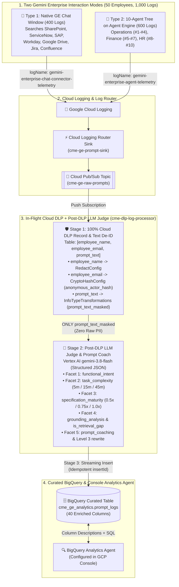
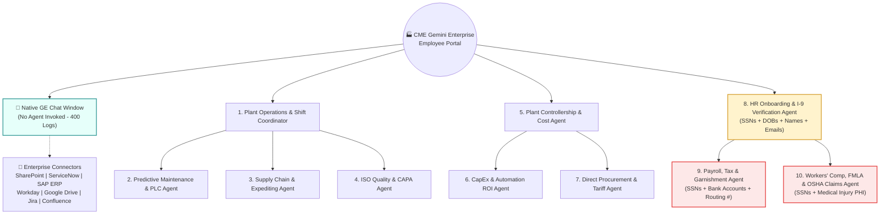

# CME Manufacturing — Gemini Enterprise Prompt Analytics, 100% Cloud DLP & Post-DLP LLM Judge Pipeline
## Solution Architecture & Step-by-Step Implementation Guide

---

## 1. Executive Summary & Demo Scenario

**CME (Custom Manufacturing Enterprise)** operates four manufacturing plants (*Detroit Stamping Plant*, *Toledo Assembly Plant*, *Houston Precision Machining*, and *Cleveland Foundry & Casting*) across three shifts. CME has rolled out **Gemini Enterprise (GE)** to **50 employees** across **Operations**, **Finance**, and **HR**.

Employees interact with Gemini Enterprise in **two ways**:
1. **Type 1 — Native Gemini Enterprise Chat Window + Enterprise Connectors (400 Logs):**
   * Employees type questions directly into the standard Gemini Enterprise chat window (`discoveryengine.googleapis.com` / `StreamAssist`).
   * Gemini Enterprise grounds responses by searching connected enterprise data stores (**SharePoint**, **ServiceNow**, **SAP ERP**, **Google Drive**, **Workday**, **Jira**, and **Confluence**) without invoking any custom agent (`agent_invoked: null`).
2. **Type 2 — Vertex AI Agent Engine 10-Agent Tree (600 Logs):**
   * Employees invoke CME's **10 specialized ADK Agents** hosted on **Vertex AI Agent Engine** (`aiplatform.googleapis.com/ReasoningEngine`), organized under 3 domain pillars (**Operations #1–#4**, **Finance #5–#7**, and **HR #8–#10**).

### Business, Security & ROI Challenges Solved by This Architecture
* **100% Cloud DLP Record & Text De-identification (Zero Raw PII in BigQuery or LLM Judge):** A single saved Cloud DLP De-identification Template (`cme-ge-prompt-deidentify-template`) processes a structured 3-column `Table` (`employee_name`, `employee_email`, `prompt_text`):
  1. `employee_name` $\rightarrow$ Completely removed via Cloud DLP **`RedactConfig`**.
  2. `employee_email` $\rightarrow$ Deterministically hashed via Cloud DLP **`CryptoHashConfig`** into `anonymous_actor_hash` (`50 employees` $\rightarrow$ `50 unique IDs`).
  3. `prompt_text` $\rightarrow$ Free-text SSNs, Bank Accounts, Names, Emails, and DOBs masked/redacted via Cloud DLP **`InfoTypeTransformations`**.
* **Post-DLP LLM Judge & Prompt Coach (`gemini-3.8-flash` on Vertex AI):** Strictly **after** Cloud DLP strips PII/PHI, the Cloud Run Function calls **`gemini-3.8-flash`** using Structured Outputs to classify `prompt_text_masked` and generate Level 3 prompt rewrites across the **5-Facet Enterprise Prompt Analytics, ROI & Coaching Framework**:
  * **Facet 1 (`functional_intent`):** Generation, Summarization, Coding/PLC/SQL, Q&A, Extraction, or Analytical Reasoning.
  * **Facet 2 (`task_complexity`):** Low (`5m`), Medium (`15m`), or High (`45m`).
  * **Facet 3 (`specification_maturity`):** Level 1 (`0.5x`), Level 2 (`0.75x`), or Level 3 (`1.0x`), plus `is_search_query_style` ("Google Search Habit" detection).
  * **Facet 4 (`grounding_analysis` & `is_retrieval_gap`):** Identifies where employees ask CME-specific questions without RAG grounding (`requires_enterprise_knowledge = TRUE` and `grounding_type = 'parametric_general'`).
  * **Facet 5 (`prompt_coaching` & `potential_extra_minutes_unlocked`):** Identifies missing prompt elements, provides actionable coaching recommendations, generates a Gold-Standard Level 3 prompt rewrite, and recommends the target CME Agent or Connector.
* **Cross-Pillar Operational Intelligence ("The Line 3 Hydraulic Press Story"):** Connects shop-floor PLC faults (`ERR-PLC-409` on the Line 3 Schuler 800T Hydraulic Press) with off-spec steel coils (`Apex Steel Lot #402` in Quality & Procurement), scrap cost variance (`$142.4K MTD` in Finance), and Line 3 press-jam Workers' Comp injury claims in HR.

---

## 2. End-to-End Architecture

### 2.1 Pipeline Data Flow (`Cloud Logging -> Pub/Sub -> Cloud Run [100% Cloud DLP + Gemini 3.8 Flash Judge] -> BigQuery`)



---

### 2.2 The CME 10-Agent Tree + Native GE Connectors Topology



---

## 3. 100% Cloud DLP Record De-identification & Post-DLP LLM Judge

### 3.1 Saved Cloud DLP Templates (`cme-ge-prompt-inspect-template` & `cme-ge-prompt-deidentify-template`)
Provisioned by [`scripts/setup_dlp_templates.py`](file:///Users/wanderas/Documents/gcp/NewProjects/cme-ge-prompt-analytics-demo/scripts/setup_dlp_templates.py) and visible in **GCP Console $\rightarrow$ Security $\rightarrow$ Sensitive Data Protection $\rightarrow$ Configuration $\rightarrow$ Templates**:

| Template ID | Purpose | Configuration Details |
| :--- | :--- | :--- |
| **`cme-ge-prompt-inspect-template`** | Detects sensitive PII, financial data, and medical PHI in `prompt_text` | • **Built-in InfoTypes:** `US_SOCIAL_SECURITY_NUMBER`, `PERSON_NAME`, `EMAIL_ADDRESS`, `DATE_OF_BIRTH`, `FINANCIAL_ACCOUNT_NUMBER`, `US_BANK_ROUTING_MICR`, `MEDICAL_TERM`<br>• **Custom InfoType (`CME_SYNTHETIC_US_SSN`):** Regex `\b000-\d{2}-\d{4}\b` (`VERY_LIKELY`) so synthetic `000-XX-XXXX` demo SSNs are caught alongside real SSNs. |
| **`cme-ge-prompt-deidentify-template`** | Single-call `record_transformations` (`field_transformations`) across `employee_name`, `employee_email`, and `prompt_text` | • **Field Rule 1 (`employee_name`):** `RedactConfig` completely removes the employee's name.<br>• **Field Rule 2 (`employee_email`):** `CryptoHashConfig` deterministically hashes the employee's email inside Cloud DLP (`50 employees` $\rightarrow$ `50 unique anonymous_actor_hash IDs`).<br>• **Field Rule 3 (`prompt_text`):** `InfoTypeTransformations` masks SSNs (`***-**-7742`) and `FINANCIAL_ACCOUNT_NUMBER` (`******8812`), replaces `PERSON_NAME`, `EMAIL_ADDRESS`, `DATE_OF_BIRTH`, and `US_BANK_ROUTING_MICR` with `[INFO_TYPE]` tags, and preserves `MEDICAL_TERM` text intact for injury root-cause analytics. |

---

### 3.2 Post-DLP LLM Judge & Prompt Coach (`gemini-3.8-flash` on Vertex AI)
Inside [`cloud_function/main.py`](file:///Users/wanderas/Documents/gcp/NewProjects/cme-ge-prompt-analytics-demo/cloud_function/main.py), `evaluate_prompt_with_llm_judge()` runs **strictly after** Cloud DLP de-identification:
* **Model:** `gemini-3.8-flash` via the official `google-genai` SDK (`temperature=0.0`, `response_mime_type="application/json"`, `response_schema=LLMJudgeClassification`).
* **Input:** Only `prompt_text_masked`, `department`, `interaction_type`, `leaf_agent`, `connectors_queried`, and `dlp_info_types` (zero raw PII).
* **Output Columns Added to BigQuery (`cme_ge_analytics.prompt_logs`):**
  * `functional_intent`: `'generation_drafting' | 'transformation_summary' | 'code_scripting' | 'info_seeking_qa' | 'data_extraction' | 'analytical_reasoning'`
  * `task_complexity`: `'low'` (`5 min`), `'medium'` (`15 min`), or `'high'` (`45 min`)
  * `specification_maturity`: `STRUCT<level, has_persona, has_explicit_format, has_constraints, is_search_query_style>`
  * `grounding_analysis`: `STRUCT<grounding_type, requires_enterprise_knowledge, target_corpus>`
  * `is_retrieval_gap`: `TRUE` when `requires_enterprise_knowledge = TRUE` and `grounding_type = 'parametric_general'`
  * `estimated_manual_minutes`, `maturity_multiplier` (`0.5`, `0.75`, `1.0`), `adjusted_minutes_saved`, and `potential_extra_minutes_unlocked`
  * `prompt_coaching`: `STRUCT<needs_improvement, missing_elements, improvement_recommendation, rewritten_level_3_prompt, recommended_target_agent_or_connector>`

---

## 4. Repository Structure

```text
cme-ge-prompt-analytics-demo/
├── README.md
├── implementation.md                                           # This architecture & deployment guide
├── data/
│   ├── employees/
│   │   └── cme_employees_50.json                               # 50 CME employees across Operations, Finance, and HR
│   ├── raw_ge_chat_connector_logs/
│   │   └── ge_chat_connector_logs_400.jsonl                    # 400 raw logs: Native GE Chat Window + Enterprise Connectors
│   ├── raw_agent_tree_logs/
│   │   └── agent_tree_logs_600.jsonl                           # 600 raw logs: Vertex AI Agent Engine 10-Agent Tree
│   └── curated_bigquery_post_dlp/
│       └── cme_bigquery_masked_1000.jsonl                      # 1,000 unified post-DLP & LLM-Judge-coached BigQuery rows (40 columns)
├── scripts/
│   ├── generate_synthetic_logs.py                              # Generates the 50 employees and 400 + 600 log files
│   ├── setup_dlp_templates.py                                  # Creates the 2 saved Cloud DLP Templates (Record + InfoType De-ID)
│   └── ingest_to_cloud_logging.py                              # Batch-writes raw JSONL logs to Google Cloud Logging API
├── cloud_function/
│   ├── main.py                                                 # 2nd Gen Cloud Run Function (Cloud DLP Table + Gemini 3.8 Flash Judge + BQ)
│   └── requirements.txt                                        # Python dependencies (google-cloud-dlp, google-genai, pydantic, etc.)
└── bigquery/
    └── schema_and_queries.sql                                  # BigQuery 40-column table DDL + 6 Executive, ROI, RAG, Coaching & CISO SQL queries
```

---

## 5. Step-by-Step GCP Implementation Steps

### Step 0: Set Environment Variables & Enable Required APIs

```bash
export PROJECT_ID="your-gcp-project-id"
export REGION="us-central1"

gcloud config set project "$PROJECT_ID"

gcloud services enable \
  logging.googleapis.com \
  pubsub.googleapis.com \
  dlp.googleapis.com \
  aiplatform.googleapis.com \
  cloudfunctions.googleapis.com \
  run.googleapis.com \
  eventarc.googleapis.com \
  cloudbuild.googleapis.com \
  bigquery.googleapis.com
```

---

### Step 1: Set Up Local Virtual Environment

*(Note: The 400 + 600 synthetic logs in [`data/`](file:///Users/wanderas/Documents/gcp/NewProjects/cme-ge-prompt-analytics-demo/data) are already generated and ready to use.)*

```bash
python3 -m venv .venv
.venv/bin/pip install google-cloud-dlp google-cloud-logging google-cloud-bigquery google-genai pydantic
```

---

### Step 2: Create or Update the Saved Cloud DLP Templates (Show in GCP Console)

Run [`scripts/setup_dlp_templates.py`](file:///Users/wanderas/Documents/gcp/NewProjects/cme-ge-prompt-analytics-demo/scripts/setup_dlp_templates.py) with `--test` to provision both templates (`cme-ge-prompt-inspect-template` and `cme-ge-prompt-deidentify-template`) and execute a live 3-column `Table` verification (`employee_name`, `employee_email`, `prompt_text`) against the Cloud DLP API:

```bash
.venv/bin/python scripts/setup_dlp_templates.py --project "$PROJECT_ID" --test
```

* **Open in GCP Console to show the customer:**
  `https://console.cloud.google.com/security/sensitive-data-protection/landing/configuration/templates?project=$PROJECT_ID`

---

### Step 3: Create the BigQuery Dataset & Table (`cme_ge_analytics.prompt_logs`)

Run the DDL statements from [`bigquery/schema_and_queries.sql`](file:///Users/wanderas/Documents/gcp/NewProjects/cme-ge-prompt-analytics-demo/bigquery/schema_and_queries.sql):

```bash
bq --project_id="$PROJECT_ID" query --use_legacy_sql=false < bigquery/schema_and_queries.sql
```

---

### Step 4: Create the Pub/Sub Topic & Deploy the Cloud Run DLP + LLM Judge Function

```bash
# 1. Create the Pub/Sub topic that receives matched logs from Cloud Logging
gcloud pubsub topics create cme-ge-raw-prompts --project="$PROJECT_ID"

# 2. Deploy the 2nd Gen Cloud Run Function triggered by Pub/Sub
gcloud functions deploy cme-dlp-log-processor \
  --gen2 \
  --runtime=python311 \
  --region="$REGION" \
  --source=./cloud_function \
  --entry-point=process_prompt_log \
  --trigger-topic=cme-ge-raw-prompts \
  --set-env-vars="GOOGLE_CLOUD_PROJECT=${PROJECT_ID},DLP_LOCATION=global,VERTEX_LOCATION=global,LLM_JUDGE_MODEL=gemini-3.8-flash,BQ_DATASET=cme_ge_analytics,BQ_TABLE=prompt_logs" \
  --project="$PROJECT_ID"
```

---

### Step 5: Create the Cloud Logging Router Sink (`cme-ge-prompt-sink`)

Configure a Cloud Logging Sink that routes both **Native GE Chat Connector logs** and **10-Agent Tree logs** into the `cme-ge-raw-prompts` Pub/Sub topic:

```bash
# 1. Create the Log Sink with an Inclusion Filter for both GE log streams
gcloud logging sinks create cme-ge-prompt-sink \
  "pubsub.googleapis.com/projects/${PROJECT_ID}/topics/cme-ge-raw-prompts" \
  --log-filter='logName="projects/'"${PROJECT_ID}"'/logs/gemini-enterprise-chat-connector-telemetry" OR logName="projects/'"${PROJECT_ID}"'/logs/gemini-enterprise-agent-telemetry"' \
  --project="$PROJECT_ID"

# 2. Grant the Log Sink's writer identity permission to publish to the Pub/Sub topic
SINK_WRITER=$(gcloud logging sinks describe cme-ge-prompt-sink --project="$PROJECT_ID" --format='value(writerIdentity)')

gcloud pubsub topics add-iam-policy-binding cme-ge-raw-prompts \
  --member="$SINK_WRITER" \
  --role="roles/pubsub.publisher" \
  --project="$PROJECT_ID"
```

---

### Step 6: Ingest the 1,000 Synthetic Logs into Cloud Logging

Run [`scripts/ingest_to_cloud_logging.py`](file:///Users/wanderas/Documents/gcp/NewProjects/cme-ge-prompt-analytics-demo/scripts/ingest_to_cloud_logging.py) to push the **400 Native GE Chat Connector logs** and **600 Agent Tree logs** into Cloud Logging via the Cloud Logging API:

```bash
# Ingest all 1,000 logs (or pass --source chat / --source agent to ingest one type at a time)
.venv/bin/python scripts/ingest_to_cloud_logging.py --project "$PROJECT_ID" --source all
```

---

## 6. Customer Demo Script ("Show & Tell" Flow)

1. **Show the Raw Source Files Side-by-Side in IDE:**
   * Open [`ge_chat_connector_logs_400.jsonl`](file:///Users/wanderas/Documents/gcp/NewProjects/cme-ge-prompt-analytics-demo/data/raw_ge_chat_connector_logs/ge_chat_connector_logs_400.jsonl) to show **Native GE Chat Window** queries hitting **SharePoint, ServiceNow, SAP, Workday, and Google Drive connectors** (`agent_invoked: null`).
   * Open [`agent_tree_logs_600.jsonl`](file:///Users/wanderas/Documents/gcp/NewProjects/cme-ge-prompt-analytics-demo/data/raw_agent_tree_logs/agent_tree_logs_600.jsonl) to show **Vertex AI Agent Engine 10-Agent Tree** hops (`root_agent` $\rightarrow$ `leaf_agent`).
   * Point out the raw `employee_name`, `employee_email`, and unmasked `000-XX-XXXX` SSNs in the HR and Operations shadow-prompt records.
2. **Show the Saved Cloud DLP Templates in GCP Console:**
   * Open **Security $\rightarrow$ Sensitive Data Protection $\rightarrow$ Templates** and click into `cme-ge-prompt-inspect-template` and `cme-ge-prompt-deidentify-template`.
   * Highlight that `cme-ge-prompt-deidentify-template` handles **all three fields** in a single template (`RedactConfig` on `employee_name`, `CryptoHashConfig` on `employee_email`, and `InfoTypeTransformations` on `prompt_text`).
3. **Show the Post-DLP LLM Judge (`gemini-3.8-flash`) & BigQuery Analytics (`cme_ge_analytics.prompt_logs`):**
   * Run Queries 1–6 in [`bigquery/schema_and_queries.sql`](file:///Users/wanderas/Documents/gcp/NewProjects/cme-ge-prompt-analytics-demo/bigquery/schema_and_queries.sql) (or ask your **BigQuery Analytics Agent** in the GCP Console):
     * **Objective 1 (Workforce Prompting Maturity):** *"Which Business Unit has the lowest Workforce Maturity Index (WMI) and highest 'Google Search Habit' (`is_search_query_style`), and needs prompt engineering training?"*
     * **Objective 2 (Connector Utilization & Retrieval Gaps):** *"Where are employees asking questions that require internal CME knowledge without triggering an Enterprise Connector (`is_retrieval_gap = TRUE`)?"*
     * **Objective 3 (Business Unit ROI):** *"How many net hours have Operations, Finance, and HR saved based on task complexity and prompt maturity (`adjusted_minutes_saved`), and how many additional hours can be unlocked via Level 3 Prompt Coaching (`potential_extra_minutes_unlocked`)?"*
     * **CISO & Cross-Tree Correlation:** *"Which Enterprise Connectors and Agents have the highest SSN and Toxic Combination exposure, and how does the Line 3 press fault (`ERR-PLC-409`) correlate with HR Workers' Comp claims?"*
     * **Prompt Coach & Enablement View:** *"Show the top coaching recommendations, missing prompt elements, and Gold-Standard Level 3 rewritten prompts (`prompt_coaching.rewritten_level_3_prompt`)."*
